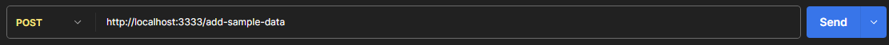

# Drug Store Backend

## Description

This project is the backend for the Drug Store application, developed with the [NestJS](https://nestjs.com/) framework. NestJS is a progressive Node.js framework designed for building efficient and scalable server-side applications.

## Prerequisites

Before you begin, ensure you have met the following requirements:
- Node.js (Version 12.x or above recommended)
- npm (Version 6.x or above recommended)
- MongoDB (Local installation or cloud-based service like MongoDB Atlas)
- A .env file created based on the `.env-example` for environment variables setup

## Installation

Follow these steps to get your development environment set up:

1. Clone the repository to your local machine.
2. Navigate to the project directory.
3. Install dependencies with:

    ```bash
    npm install
    ```

## Running the Application

You can run the application in various modes:

- For development (with hot reload):

    ```bash
    npm run start:dev
    ```

- For production:

    ```bash
    npm run start:prod
    ```

## Running Tests

Execute the following commands to run tests:

- Unit tests:

    ```bash
    npm run test
    ```

- End-to-End tests:

    ```bash
    npm run test:e2e
    ```

- Test coverage:

    ```bash
    npm run test:cov
    ```

## Making Requests


### POST Request Example

To populate your MongoDB database with sample data:

1. Use the POST method for a new request.
2. Enter `http://localhost:3333/add-sample-data` as the request URL.
3. Click Send.

Now you have a mock data on your Mongo DB

### GET Request Example

To retrieve all stores, use the following steps:

1. Open Postman or any HTTP client of your choice.
2. Create a new request with the GET method.
3. Enter `http://localhost:3333/stores` as the request URL.
4. Click Send.
